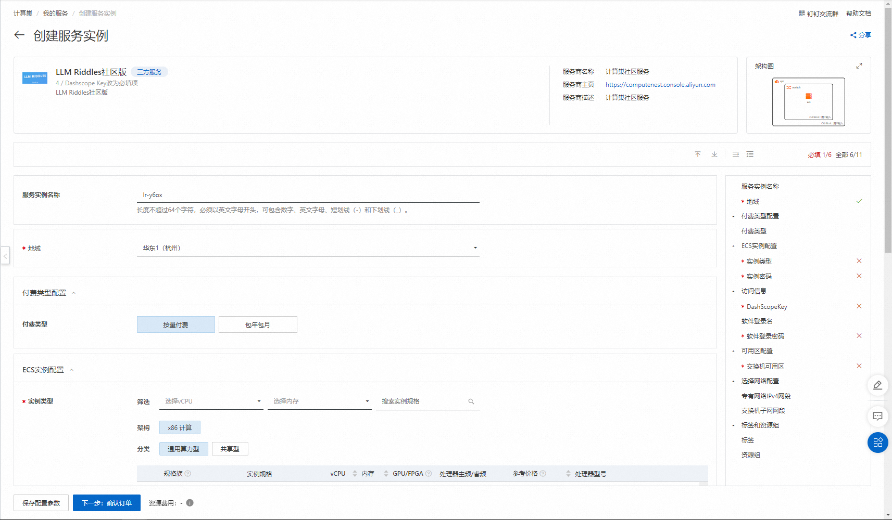
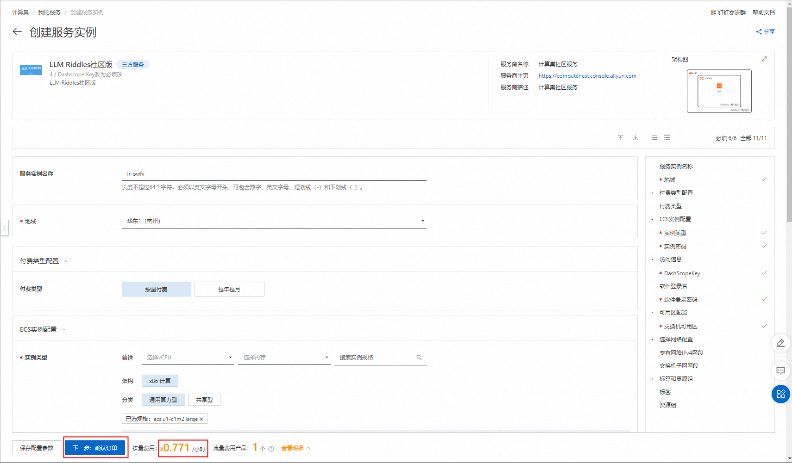
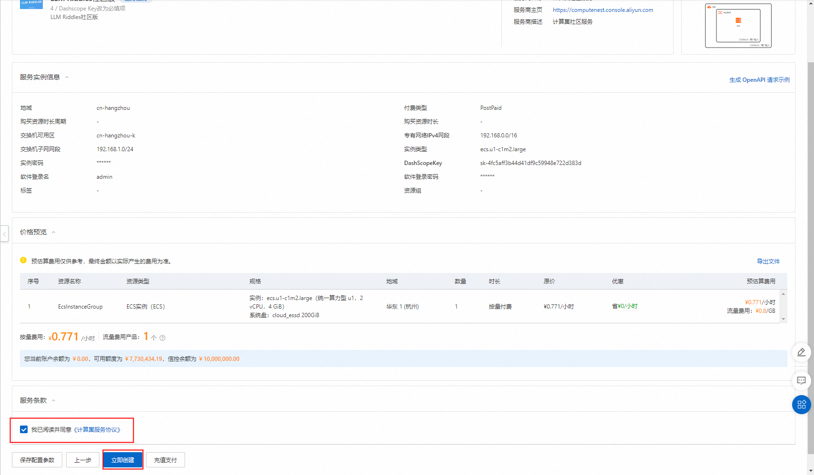
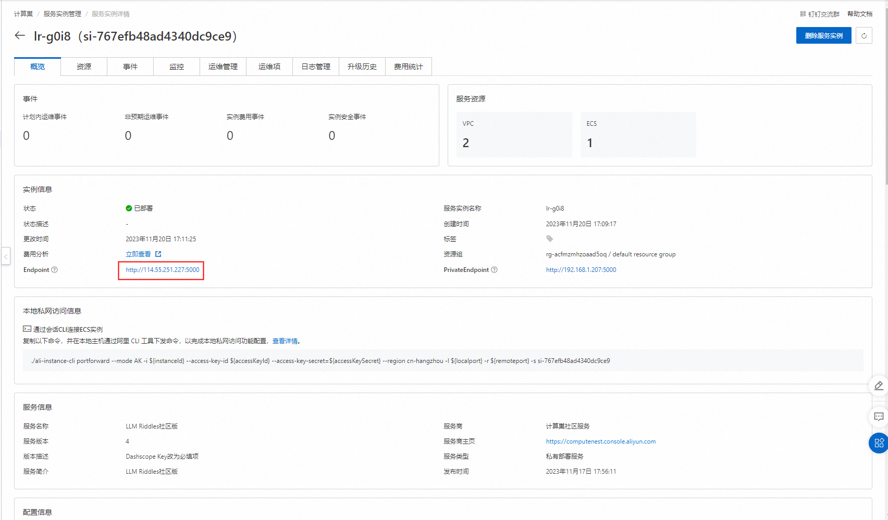

# LLM Riddles社区版计算巢快速部署

>**免责声明：**本服务由第三方提供，我们尽力确保其安全性、准确性和可靠性，但无法保证其完全免于故障、中断、错误或攻击。因此，本公司在此声明：对于本服务的内容、准确性、完整性、可靠性、适用性以及及时性不作任何陈述、保证或承诺，不对您使用本服务所产生的任何直接或间接的损失或损害承担任何责任；对于您通过本服务访问的第三方网站、应用程序、产品和服务，不对其内容、准确性、完整性、可靠性、适用性以及及时性承担任何责任，您应自行承担使用后果产生的风险和责任；对于因您使用本服务而产生的任何损失、损害，包括但不限于直接损失、间接损失、利润损失、商誉损失、数据损失或其他经济损失，不承担任何责任，即使本公司事先已被告知可能存在此类损失或损害的可能性；我们保留不时修改本声明的权利，因此请您在使用本服务前定期检查本声明。如果您对本声明或本服务存在任何问题或疑问，请联系我们。

## 概述

LLM Riddles 是一个智力游戏或谜题解决应用程序。它提供了许多不同类型的谜题和难题，旨在挑战你的思维和解决问题的能力。
这个应用程序通常会给你一个谜题或问题的描述，并要求你通过逻辑推理、分析和思考来寻找答案。这些谜题可能涉及数字、字母、图形、逻辑、谜语、数学等不同的领域。
通过解决这些谜题，LLM Riddles 可以帮助你锻炼你的大脑，提高你的问题解决能力、创造力和思维灵活性。
这个应用程序通常被视为一种娱乐方式，同时也是一种训练大脑和思维能力的工具。它可以在休闲时间、旅途中或任何你想挑战自己的时候使用。
总的来说，LLM Riddles 是一个提供各种智力谜题和挑战的应用程序，旨在帮助你锻炼思维和解决问题的能力。

## 计费说明

LLM Riddles计算巢上的费用主要涉及：

- 所选vCPU与内存规格
- 系统盘类型及容量
- 公网带宽

## 部署架构

## RAM账号所需权限

部署LLM Riddles社区版服务实例，需要对部分阿里云资源进行访问和创建操作。因此您的账号需要包含如下资源的权限。
  **说明**：当您的账号是RAM账号时，才需要添加此权限。

| 权限策略名称                          | 备注                     |
|---------------------------------|------------------------|
| AliyunECSFullAccess             | 管理云服务器服务（ECS）的权限       |
| AliyunVPCFullAccess             | 管理专有网络（VPC）的权限         |
| AliyunROSFullAccess             | 管理资源编排服务（ROS）的权限       |
| AliyunComputeNestUserFullAccess | 管理计算巢服务（ComputeNest）的用户侧权限 |

## 部署流程
1. 访问计算巢LLM Riddles社区版[部署链接](https://computenest.console.aliyun.com/service/instance/create/cn-hangzhou?ServiceId=service-901d0194cd9b444f9acf&ServiceVersion=4)
，按提示填写部署参数：
    

2. 参数填写完成后可以看到对应询价明细，确认参数后点击**下一步：确认订单**。
   

3. 确认订单完成后同意服务协议并点击**立即创建**
   进入部署阶段。
    

4. 等待部署完成后就可以开始使用服务，进入服务实例详情点击Endpoint链接。
    

5. 在弹出的页面中输入自己设置的软件账号和密码。
    

7. 登录就能创建自己的LLM Riddles应用了
    